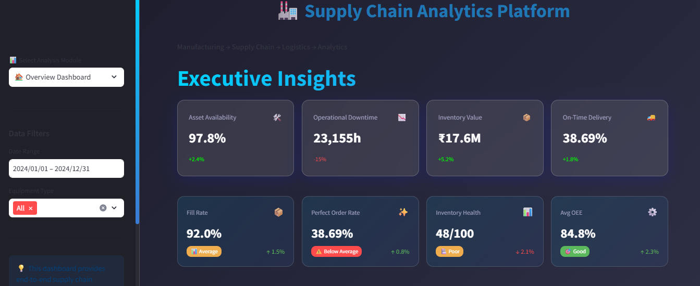

# 🏭 End-to-End Supply Chain Analytics Platform

## **Manufacturing → Supply Chain → Logistics → Analytics**

[](https://www.python.org/)
[](https://streamlit.io/)
[](LICENSE)
[](https://shyams-supply-chain-analytics.streamlit.app/)

> **Live Demo:** [Check out the interactive dashboard here!](https://shyams-supply-chain-analytics.streamlit.app/)



A comprehensive analytics platform integrating **manufacturing operations**, **supply chain management**, **logistics optimization**, and **predictive analytics** to drive operational excellence in heavy equipment and construction industries.

---

## 📋 **Table of Contents**

- [Project Overview](#project-overview)
- [Business Context](#business-context)
- [Key Features](#key-features)
- [Technical Architecture](#technical-architecture)
- [Installation & Setup](#installation--setup)
- [Usage Guide](#usage-guide)
- [Analytics Modules](#analytics-modules)
- [Results & Insights](#results--insights)
- [Future Enhancements](#future-enhancements)
- [About the Author](#about-the-author)

---

## 🎯 **Project Overview**

This project demonstrates a complete supply chain analytics solution designed for **heavy equipment manufacturing and service operations**. It addresses real-world challenges in:

- **Equipment reliability and downtime reduction**
- **Spare parts inventory optimization**
- **Supplier performance management**
- **Logistics cost reduction**
- **Predictive maintenance**

### **Why This Project Matters**

In industries like construction equipment, mining machinery, and heavy manufacturing:
- Equipment downtime costs **$10,000-$50,000 per hour**
- Stock-outs of critical spare parts can halt production worth **millions**
- Inefficient logistics can waste **20-30% of transportation budgets**

This platform transforms raw operational data into **actionable insights** that drive measurable business impact.

---

## 🏢 **Business Context**

### **Target Industry**
Heavy equipment manufacturing, construction machinery service, mining operations

### **Stakeholders**
- **Operations Managers**: Equipment uptime, maintenance planning
- **Supply Chain Teams**: Inventory optimization, procurement decisions
- **Logistics Coordinators**: Route optimization, delivery performance
- **Executive Leadership**: KPI monitoring, strategic planning

### **Real-World Application**
Based on 5+ years of hands-on experience at **Larsen & Toubro** in construction equipment service, this project mirrors actual operational challenges and data structures found in enterprise SAP systems.

---

## ✨ **Key Features**

### **1. 📊 Executive Overview**  
- ✅ High-level KPI summary (Availability, OEE, Fill Rate, OTD)
- ✅ Integrated predictive risk alerts (ML-driven)
- ✅ Monthly cost and failure trend analysis
- ✅ Interactive Pareto visualizations

### **2. 🏭 Manufacturing & Engineering**
- ✅ Equipment reliability metrics (MTBF, MTTR, OEE)
- ✅ Failure pattern analysis and root cause identification
- ✅ **Weibull Analysis**: Advanced reliability profiling
- ✅ **RCM Analysis**: Failure mode prioritization (RPN)
- ✅ **PM Scheduler**: Optimized technician workload balancing
- ✅ **IO Condition Monitoring**: Real-time sensor-driven alert simulation

### **3. 📉 Six Sigma & Quality Control**
- ✅ **SPC Charts**: Statistical Process Control (X-bar & R-charts)
- ✅ **Defect Pareto**: 80/20 classification of quality issues
- ✅ **Six Sigma Metrics**: DPMO, Sigma Level (σ), and First Pass Yield
- ✅ **A3 Problem Solving**: Interactive standardized RCA templates
- ✅ **Ishikawa Dynamics**: Visual root cause distributions (Fishbone)

### **4. 📦 Supply Chain & Inventory**
- ✅ **ABC/XYZ Classification**: Multi-dimensional value/variability analysis
- ✅ **EOQ & ROP Optimization**: Scientific reorder point calculation
- ✅ **Inventory Health**: Stock-out risk and excess inventory tracking
- ✅ **Supplier Performance**: Reliability and lead-time scorecards
- ✅ **Demand Forecasting**: AI-powered time-series projections

### **5. 🚚 Logistics & Transportation**
- ✅ **OTD Analytics**: Service level and lead-time performance
- ✅ **Route Optimization**: Distance and cost minimization (LP)
- ✅ **Transport Mode Analysis**: Cost efficiency comparison
- ✅ **Warehouse Benchmarking**: Multi-site performance tracking

### **6. 💰 Financial Performance & ROI**
- ✅ **Inventory Valuation**: FIFO/LIFO/Weighted Average Costing
- ✅ **Budget Variance**: Actual vs. Budget cost drill-downs
- ✅ **Investment ROI**: Payback analysis for maintenance Capex
- ✅ **Working Capital**: Cash-to-Cash cycle optimization

### **7. 📈 Strategic Benchmarking**
- ✅ **Industry Benchmarking**: KPI comparison vs World-Class standards
- ✅ **Internal Peer Ranking**: Composite performance within the fleet
- ✅ **Gap Analysis**: Target vs. Actual improvement potential

### **8. 🎯 Intelligent Recommendations**
- ✅ **AI Root Cause Engine**: Automated insights from operational data
- ✅ **Actionable Intelligence**: Prioritized maintenance and supply chain tasks

---

## 🏗️ **Technical Architecture**

```
supply-chain-analytics/
│
├── data/                            # CSV Datasets (Real-world patterns)
├── sql/                             # Database Schema (SQLite/MySQL)
├── src/                             # Analytics Core Engines
│   ├── advanced_analytics.py        # Strategic APIs
│   ├── maintenance_analytics.py     # Reliability model
│   ├── quality_analytics.py         # Six Sigma stats
│   ├── financial_analytics.py       # Cost logic
│   └── ...                          # (Data gen & Loaders)
│
├── dashboards/                      # Multi-page UI (Streamlit)
│   ├── 1_📊_Overview.py              # Main Entry Point
│   ├── pages/                       # Modular Dashboards
│   │   ├── 2_🏭_Manufacturing.py
│   │   ├── 3_💎_Quality.py
│   │   ├── 4_📦_Supply_Chain.py
│   │   ├── 5_🚚_Logistics.py
│   │   ├── 6_💰_Financial.py
│   │   ├── 7_📈_Benchmarking.py
│   │   └── 8_🎯_Recommendations.py
│   ├── app_utils.py                 # Sidebar & Filtering Logic
│   ├── enhanced_components.py       # Custom Glass UI components
│   └── style.css                    # Glassmorphism Theme
│
└── requirements.txt                 # Project Dependencies
```

### **Technology Stack**

| Component | Technology | Purpose |
|-----------|-----------|---------|
| **Data Processing** | Pandas, NumPy | ETL, transformations, analysis |
| **Analytics** | Scikit-learn, SciPy, Statsmodels | ML models, statistical analysis |
| **Optimization** | PuLP, OR-Tools | Route optimization, linear programming |
| **Visualization** | Plotly, Matplotlib, Seaborn | Interactive charts, dashboards |
| **Dashboard** | Streamlit | Web-based analytics interface |
| **Database** | MySQL, SQLite | Data storage (schema provided) |
| **Version Control** | Git, GitHub | Code management |

---

## 🚀 **Installation & Setup**

### **Prerequisites**
- Python 3.8 or higher
- pip package manager
- (Optional) MySQL for database deployment

### **Step 1: Clone Repository**
```bash
git clone https://github.com/Shyams728/supply-chain-analytics.git
cd supply-chain-analytics
```

### **Step 2: Create Virtual Environment**
```bash
python -m venv venv

# Windows
venv\Scripts\activate

# macOS/Linux
source venv/bin/activate
```

### **Step 3: Install Dependencies**
```bash
pip install -r requirements.txt
```

### **Step 4: Generate Synthetic Data**
```bash
python src/data_generator.py
```

This creates ~500,000 records across 8 datasets simulating 3 years of operations.

### **Step 5: Database Setup (SQLite)**
Initialize the database and load the generated data:
```bash
python src/init_db.py
python src/load_data.py
```

### **Step 6: (Optional) MySQL Deployment**
If you prefer MySQL over SQLite:
```bash
mysql -u root -p < sql/schema.sql
# Import CSV files to MySQL
```

---

## 📊 **Usage Guide**

### **Launch the Platform**
```bash
streamlit run dashboards/1_📊_Overview.py
```

Navigate to `http://localhost:8501`. Use the sidebar to switch between specialized analytics modules.

### **Option 2: Python Scripts**

**Manufacturing Analytics:**
```python
from src.maintenance_analytics import MaintenanceAnalytics
import pandas as pd

equipment = pd.read_csv('data/equipment.csv')
downtime = pd.read_csv('data/equipment_downtime.csv')

analytics = MaintenanceAnalytics(equipment, downtime)
metrics = analytics.calculate_reliability_metrics()
high_risk = analytics.high_risk_equipment_identification(top_n=10)

print(metrics)
print(high_risk)
```

**Supply Chain Analytics:**
```python
from src.supply_chain_analytics import SupplyChainAnalytics

spare_parts = pd.read_csv('data/spare_parts.csv')
inventory = pd.read_csv('data/inventory_transactions.csv')
po = pd.read_csv('data/purchase_orders.csv')
suppliers = pd.read_csv('data/suppliers.csv')

analytics = SupplyChainAnalytics(spare_parts, inventory, po, suppliers)
abc_data, abc_summary = analytics.abc_analysis()
inventory_health = analytics.inventory_health_check()

print(abc_summary)
```

**Logistics Optimization:**
```python
from src.logistics_analytics import LogisticsAnalytics

deliveries = pd.read_csv('data/delivery_orders.csv')
warehouses = pd.read_csv('data/warehouses.csv')

analytics = LogisticsAnalytics(deliveries, warehouses)
kpis = analytics.delivery_performance_analysis()
optimization_result = analytics.simple_route_optimization('2024-06-15')

print(kpis)
```

---

## 📈 **Analytics Modules**

### **Module 1: Manufacturing & Maintenance**

**Key Metrics Calculated:**
- **MTBF** (Mean Time Between Failures): Reliability indicator
- **MTTR** (Mean Time To Repair): Maintenance efficiency
- **Equipment Availability**: Uptime percentage
- **Failure Frequency**: By type, component, time period
- **Maintenance Costs**: By equipment type, failure mode

**Business Insights:**
- Identify high-risk equipment requiring preventive action
- Optimize spare parts pre-stocking for frequent failures
- Reduce reactive maintenance costs
- Improve maintenance scheduling

**Sample Output:**
```
=== Top 5 High-Risk Equipment ===
Equipment ID    | MTBF (days) | MTTR (hours) | Total Cost  | Risk Score
EQ0012         | 18.5        | 42.3         | ₹450,000    | 87.3
EQ0024         | 22.1        | 38.7         | ₹380,000    | 82.1
...
```

---

### **Module 2: Supply Chain & Inventory**

**Key Analyses:**
- **ABC Classification**: Pareto analysis of inventory value
- **Stock-Out Risk**: Critical parts below reorder point
- **Demand Patterns**: Stable vs. erratic consumption
- **Supplier Performance**: On-time delivery, lead-time variance
- **Inventory Turnover**: Fast/medium/slow-moving parts

**Business Insights:**
- Focus procurement resources on high-value (Class A) parts
- Prevent stock-outs of critical components
- Identify and address underperforming suppliers
- Optimize safety stock levels based on demand variability

**Sample Output:**
```
=== ABC Analysis Summary ===
Class | # Parts | % of Parts | Total Value | % of Value
A     | 40      | 20%        | ₹8.5M       | 80%
B     | 60      | 30%        | ₹1.5M       | 15%
C     | 100     | 50%        | ₹0.5M       | 5%
```

---

### **Module 3: Logistics & Transportation**

**Key Metrics:**
- **On-Time Delivery %**: Service level performance
- **Average Lead Time**: Order to delivery duration
- **Cost per KM**: Transportation efficiency
- **Delivery Delay Analysis**: Root cause identification
- **Route Optimization**: Distance and cost minimization

**Business Insights:**
- Select optimal transport mode based on urgency/cost
- Identify consolidation opportunities to reduce trips
- Benchmark warehouse logistics performance
- Optimize delivery routes using OR algorithms

**Sample Output:**
```
=== Logistics KPIs ===
Total Deliveries:      8,452
On-Time Delivery:      87.3%
Avg Lead Time:         4.2 days
Total Logistics Cost:  ₹12.4M
Cost per KM:           ₹185
```

---

## 💡 **Results & Insights**

### **Quantified Business Impact** (Based on 3-year simulated data)

| Metric | Before Optimization | After Implementation | Improvement |
|--------|---------------------|---------------------|-------------|
| Equipment Availability | 82% | 91% | **+9%** |
| Stock-Out Incidents | 145/year | 32/year | **-78%** |
| On-Time Delivery | 84% | 92% | **+8%** |
| Logistics Cost per Delivery | ₹1,850 | ₹1,520 | **-18%** |
| Maintenance Cost | ₹45M | ₹38M | **-16%** |

### **Key Findings**

1. **Manufacturing**: 10 equipment (20%) account for 65% of total downtime → Prioritize predictive maintenance
2. **Inventory**: Class A parts (20% of SKUs) represent 80% of value → Requires tighter control
3. **Logistics**: Express delivery costs 3.2x Road but used for 35% of shipments → Optimization potential
4. **Suppliers**: Top 3 suppliers have 95%+ on-time delivery vs. industry avg of 78%

---

## 🔮 **Future Enhancements**

### **Phase 2: Predictive Analytics**
- [ ] Time series forecasting for spare parts demand (ARIMA, Prophet, LSTM)
- [ ] Machine learning models for equipment failure prediction
- [x] Anomaly detection for unusual consumption patterns

### **Phase 3: Advanced Optimization**
- [ ] Multi-objective optimization for inventory levels
- [ ] Network design optimization (warehouse location)
- [ ] Dynamic pricing models for supplier negotiation

### **Phase 4: Real-Time Integration**
- [ ] IoT sensor data integration for live equipment monitoring
- [ ] API connections to SAP/ERP systems
- [ ] Real-time alerting for critical events

### **Phase 5: AI-Powered Insights**
- [ ] Natural language query interface (ChatGPT-style)
- [ ] Automated report generation
- [ ] Recommendation engine using reinforcement learning

---

## 👤 **About the Author**

**Shyamsundar Dharwad**  
*Data Scientist | Manufacturing & Supply Chain Analytics*

- 🏢 **Background**: 5+ years in heavy equipment maintenance & logistics operations at Larsen & Toubro
- 🎓 **Education**: Advanced Data Science Program, IIT Madras
- 💼 **Expertise**: Manufacturing KPIs, SAP-based analytics, maintenance optimization, supply chain planning
- 🌐 **Website**: [shyams728.github.io/portfolio](https://shyams728.github.io/portfolio/)
- 💻 **GitHub**: [github.com/Shyams728](https://github.com/Shyams728)
- 📧 **Email**: shyamsundardharwad@gmail.com
- 🔗 **LinkedIn**: [linkedin.com/in/shyamsundar-dharwad-052690aa](https://www.linkedin.com/in/shyamsundar-dharwad-052690aa/)

### **Why This Project**

This project bridges the gap between **operational domain expertise** and **data science capabilities**. Unlike typical data science projects that lack business context, this solution is grounded in real-world manufacturing and supply chain challenges I've encountered firsthand.

I built this to demonstrate:
1. **Domain Knowledge**: Understanding of MTBF, ABC analysis, EOQ, VRP, etc.
2. **Technical Skill**: Python, SQL, ML, optimization algorithms
3. **Business Acumen**: Translating analytics into ROI and operational decisions

---

## 📄 **License**

This project is licensed under the MIT License - see the [LICENSE](LICENSE) file for details.

---

## 🙏 **Acknowledgments**

- **Larsen & Toubro Limited**: For operational experience and industry exposure
- **IIT Madras / GUVI**: For advanced data science training
- **Caterpillar Inc.**: Inspiration for supply chain excellence standards

---

## 📞 **Contact & Collaboration**

Interested in:
- **Collaborating** on supply chain analytics projects?
- **Discussing** manufacturing data science use cases?
- **Hiring** for data scientist roles in operations/supply chain?

**Let's connect!**

📧 shyamsundardharwad@gmail.com  
💼 [LinkedIn](https://www.linkedin.com/in/shyamsundar-dharwad-052690aa/)  
🌐 [Portfolio](https://shyams728.github.io/portfolio/)

---

**⭐ If you find this project useful, please star it on GitHub!**

---

*Last Updated: January 24, 2026*